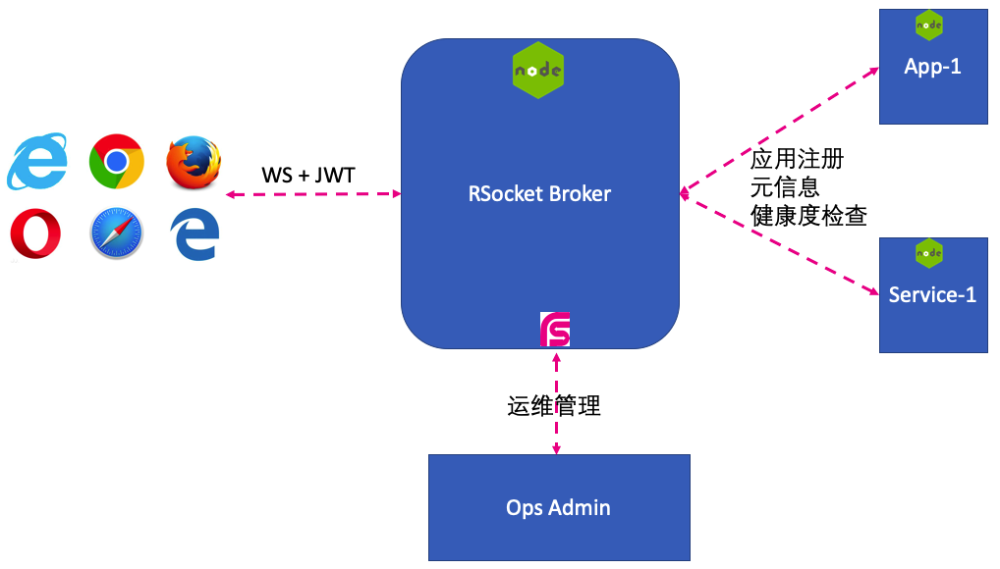

RSocket Node.js Broker
=======================

RSocket Node.js Broker，架构如下:



**注意实现**：

* 考虑到接入的应用都是基于JavaScript，所以不再采用RSocket的Composite Metadata规范，而是采用JSON数据格式的规范，样例如下：

```json
{
  "message/x.rsocket.routing.v0": [
    "com.example.logging.LoggingService.getLog",
    "e=uuid"
  ]
}
```

# 应用元信息

应用向Broker注册时，需要提供对应的元信息，如果是外部的设备接入，还需要提供接入的Token信息，请参考 https://github.com/rsocket/rsocket/blob/master/Extensions/Security/Authentication.md

应用的元信息保存在setupPayload的data中，主要信息如下：

```json
{
  "ip": "192.168.1.1",
  "port": 8080,
  "name": "app-1",
  "owner": "leijuan",
  "services": [
    "com.example.logging.LoggingService"
  ],
  "startedAt": 1111111111111
}
```

# 服务调用路由规则

RSocket的服务调用主要是基于RSocket的服务路由规范，详情请参考 https://github.com/rsocket/rsocket/blob/master/Extensions/Routing.md

RSocket的路由规则是由多个Tags组成，第一个tag是服务名称，后续的tag都是辅助路由，比如调用指定节点的服务，格式如下即可：

```json
{
  "message/x.rsocket.routing.v0": [
    "com.example.logging.LoggingService.getLog",
    "e=uuid"
  ]
}
```

# RSocket Broker的运维管理： Ops接口

为了方便Ops管理，RSocket Broker提供了另外一个RSocket监听端口(42253), 用于接收Ops请求，如你可以通过以下命令就可以查看当前的Broker上的应用信息。

```bash
rsc --request ws://localhost:42253
```

监听不同的端口主要是安全的考虑，而且也容易实现。更多的Ops需求，你只需要实现opsRequestHandler函数即可。

# 应用需求描述样例 - 日志服务

浏览器端发起RSocket请求，需要获取某一服务器下的日志信息：

* 请求类型： request/response
* 请求格式： json
* 请求路由： 需要带上对应服务器的UUID
* 服务名称: com.example.logging.LoggingService
* 服务接口: getLog(fileName, offset, limit) 其中offset为日志行号，limit为返回日志的总行数
* 返回: 日志行数

# References

* RSocket Protocol: https://rsocket.io/about/protocol
* RSocket Flowable API: https://github.com/rsocket/rsocket-js/blob/master/docs/03-flowable-api.md
* rsc: RSocket Client CLI https://github.com/making/rsc
